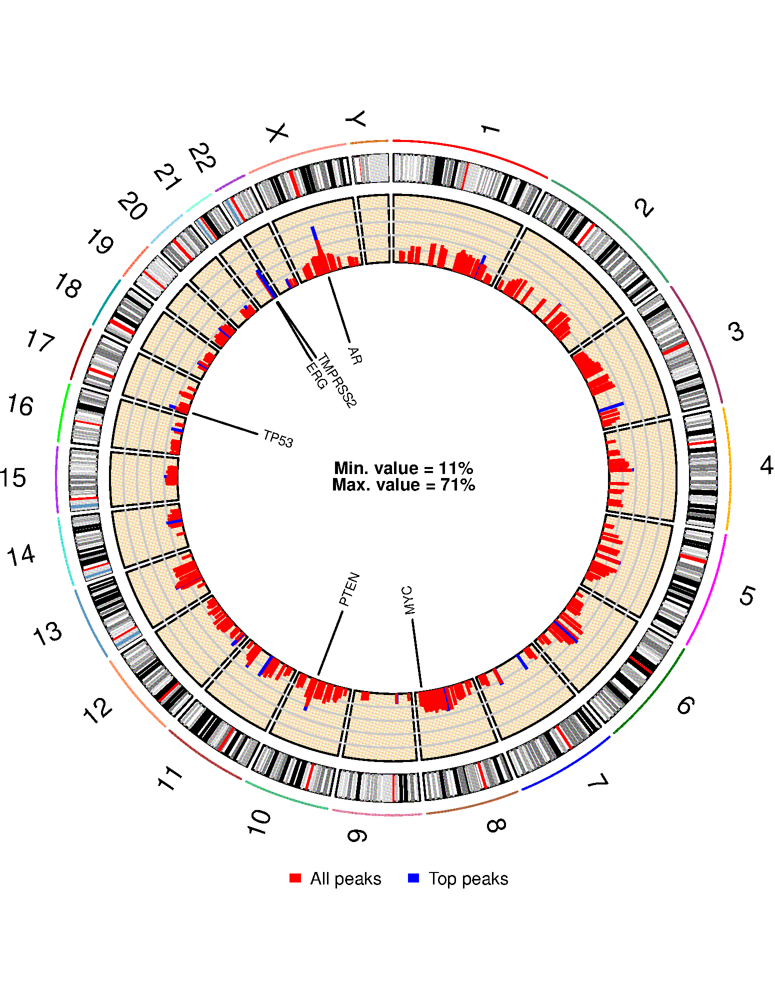

# SV-HotSpot

SV-HotSpot is structural vairant hotspots detection tool. It detects SVs and determine their effect on nearby gene expression using whole-genome sequecing data.  

##
SV-HotSpot is developed at [Christopher Maher Lab](http://www.maherlab.com/) at [Washington University in St. Louis](http://www.wustl.edu) and [The McDonnell Genome Institute](https://www.genome.wustl.edu/). 

## Getting Started

These instructions will help you to install and use SV-HotSpot tool. Please read carefully all instructions before using the tool. Also make sure that all prerequisites and R packages are installed with the versions specified.  

### Prerequisites

To run SV-HotSpot, the following tools have to be installed and included in the PATH variable:

* [Perl](https://www.perl.org/get.html)  
* [BEDTools](https://bedtools.readthedocs.io/en/latest/) version 2.25.0
* [R](https://www.r-project.org/) version 3.1.0 or higher 

Please make sure you have installed the following R packages:

 1. [peakPick](https://cran.r-project.org/web/packages/peakPick/vignettes/peakPick-vignette.html)
 2. [ggplot2](https://cran.r-project.org/web/packages/ggplot2/index.html)
 3. [reshape2](https://cran.r-project.org/web/packages/reshape2/)
 4. [grid](https://www.rdocumentation.org/packages/grid/versions/3.5.1)
 5. [gridBase](https://cran.r-project.org/web/packages/gridBase/index.html)
 6. [gridExtra](https://cran.r-project.org/web/packages/gridExtra/index.html)
 7. [gtable](https://cran.r-project.org/web/packages/gtable/index.html)
 8. [ggsignif](https://cran.r-project.org/web/packages/ggsignif/vignettes/intro.html)
 9. [plyr](https://cran.r-project.org/web/packages/plyr/index.html)
 10. [data.table](https://cran.r-project.org/web/packages/data.table/index.html)

### Installation

Download SV-HotSpot from github repository at https://github.com/ChrisMaherLab/SV-Hotspot. Click on "Clone or download" and then click on "Download ZIP". You can also use "git clone" command as follows:
```
git clone https://github.com/ChrisMaherLab/SV-Hotspot.git
```
Once the tool package is downloaded, run these commands:

```
$ unzip SV-Hotspot-master.zip
$ cd SV-Hotspot-master/SV-HotSpot
$ chmod +x install.sh
$ ./install.sh -o /SOME/PATH/
```

Note that you need to change ```/SOME/PATH/``` to wherever you want to install the tool. 
 
You also need to add the installation location to your PATH or add it to ~/.bachrc file before running the tool: 

```
export PATH=/SOME/PATH/src:$PATH
```
<b>CHANGING TOOL PATH (IMPORTANT) </b>

Open ```sv-hotspot.pl``` file and change this line by providing the path to the location where you installed the tool: 

```
my $TOOL_PATH='/gscmnt/gc5111/research/eteleeb/projects/SV-HotSpot';
```
Note that you also need to either have the ``Rscript`` in your ``/usr/bin`` as ``/usr/bin/Rscript`` or change the path of Rscript in all R scripts available at "src" folder to your Rscript location. Default ``Rscript`` path is usually at  ```/usr/bin/Rscript``` for linux OS and at ```/usr/local/bin/Rscript``` for MAC OS X. 

To ensure the the tools was installed correctly, just type the following command which shows the usage of the tool assuming the tool src directory in the PATH otherwise you need to provide the whole path to the main file. 

```
sv-hotspot.pl

USAGE:
      sv-hotspot.pl [OPTIONS] -g/--genome <genomeName> --sv <structuralVariants>

      NOTE:
	(1) Genome name should be one of the UCSC genome releases (https://genome.ucsc.edu/FAQ/FAQreleases.html#release1). 
            - Built-in Genomes: hg18, hg19, hg38, mm9, mm10, dm3, dm6, rn5, rn6.
            - Please refer to the documentation in case your genome is not listed above. 
	(2) Structutal variants file should be in "BEDPE" format.
	(3) Gene expression data and copy number segments are required to visualize hotspot regions.
	(4) Region of interest file(s) (e.g. promoters, enhancers, chip-seq, etc.) should be in "BED" format

OPTIONS:
	-w/--sliding-win-size		sliding window size	<int>		[ sliding window size. default: 100kb ]
	-s/--sliding-win-step		sliding window step 	<int>		[ sliding window step. default: 1kb ]
	-a/--annot			annotation file 	<filename>	[ an annotation file in "BED" format ]
	-e/--exp			expression file 	<filename>	[ expression file in a "matrix" format ]
	-c/--cn				Copy number file 	<filename>	[ copy number segments in BED format ]
	-W/--peakPick-window-size	peak calling window 	<int>		[ peakPick window size. default: 100bp ]
	-m/--peakPick-min-sd		peak calling min. SD	<int>		[ peakPick standard deviation cutoff. default: 5 ]
	-t/--pct-samples		percentage of samples	<int>		[ percentage of samples cutoff to call peaks. default: 10 ]
	-o/--output			output directory	<string>	[ results output directory. default: ./ ]
	-p/--pval			pvalue cuttoff		<float>		[ pvalue threshold used for significance. default: 0.05 ]
	-G/--genes-of-int		list of genes		<filename>	[ list of genes of interest to be used for visualization ]
	-r/--region-of-int		region(s) of interest	<filename>	[ region of interest file(s) in "BED" foramt separated by comma ]
	-C/--chrom			chromosome name 	<string>	[ chromosome name used to detect hotspots. default: ALL ]
	-t/--sv-type			structural variant type	<string>	[ SV type used to detect hotspots. default: ALL ]
	-d/--merge-dist-size		distance size		<int>		[ distance cutoff used to merge adjacnet peaks. default: 10kb ]
	-k/--num-nearby-genes		Number nearby genes	<int>		[ number of up/downstream genes to the peak. default: 1 ]
	--t-amp				amplification threshold	<float/int>	[ amplification cutoff. default: 2.8 ]
	--t-del				deletion threshold	<float/int>	[ deletion cutoff. default: 0.5 ]
	--stat-test			statistical test	<string>	[ statistical test used for comparison (wilcox.test or t.test). default: wilcox.test ]
	--chip-cov			chip-seq coverage	<filename>	[ chip-seq coverage file in "BED" foramt ]
	--chip-cov-lbl			chip-seq coverage label	<string>	[ label used for chip-seq coverage ]
	--plot-top-peaks		plot top # peaks	<int>		[ number of top peaks to plot. default: top 10 ]
	--left-ext			size of left extension	<int>		[ size of the left extension of the peak. default: 0bp ]
	--right-ext			size of right extension	<int>		[ size of the right extension of the peak. default: 0bp ]
 ```

### Input 
The tool requires as an inpute the following:

1. Genome assembly name (e.g. hg38, hg19, mm9, mm10, etc.) which is used to extract chromosomes sizes file (a tab-delimited file with two columns, <b>chrom</b> and <b>size</b>). Genome name should be one of the UCSC genome releases (https://genome.ucsc.edu/FAQ/FAQreleases.html#release1). Tool built-in genomes are: <b>hg18, hg19, hg38, mm9, mm10, dm3, dm6, rn5, rn6</b>. In case your genome is not listed above, please do the following:

      * Create a directoy with your genome name under ```annotations``` folder. This name will be used when run the tool.    
      * Extract the chromosomes sizes file If your genome is available as one of the UCSC genome releases by running this             command:    
       
        ```mysql --user=genome --host=genome-mysql.cse.ucsc.edu -A -e "SELECT chrom, size FROM <genomeName>.chromInfo" > chromsize.tsv```
      
      * Save the file with the name ```chromsize.tsv``` and place in the genome name folder you created in step 1.
      * In case your genome is not available in the UCSC genome releases, you need to prepare a a tab-delimited file with  
        two columns, <b>chrom</b> and <b>size</b> and do step 3. 
       
2. Structural variants file in [BEDPE format](https://bedtools.readthedocs.io/en/latest/content/general-usage.html#bedpe-format) (Example of how to prepare this file is available in <b>test_data</b> folder). 

<u>Optional files:</u> 
1. Expression data in a matrix format where the first column represents the feature (e.g. gene) and columns represents samples. See the example provided at <b>test_data</b> folder. Please note that features in this file has to be unique. 

2. Copy number segments in [BED](https://genome.ucsc.edu/FAQ/FAQformat.html) format. See the example at <b>test_data</b> on how to prepare this file.  

3. An annotation file in [BED](https://genome.ucsc.edu/FAQ/FAQformat.html) format. If the user didn't provide this file, a built-in annotation file based on the genome name will be used. Please note that the feature in the expression file has to match the one in this file. 

4. Region of interest file(s) (e.g. enhancers, transcription binding sites, etc) in [BED](https://genome.ucsc.edu/FAQ/FAQformat.html) format. An example of this file is given in <b>test_data</b> folrder. Multiple files can be provided but have to be separated by comma (make sure no space between the file names). 

5. ChIP-Seq coverage in [BED](https://genome.ucsc.edu/FAQ/FAQformat.html) format. See the example at <b>test_data</b> on how to prepare this file.  

All other parameters are optional and a default value was assigned to each (run ```sv-hotspot.pl --help``` for more details). 

<br>

<b>IMPORTANT NOTES:</b>

* To prepare all your files, please look at the examples provided in <b>test_data</b> and do accordingly. 
* Structural variant types must be in the format of THREE letters. Possible SV types the tool accepts are: ```BND, DEL, DUP, INS, INV```. 
* All files headers should be the same as the ones in the examples files. 
* The chromosome names in all files should be consistent and in the format of <b>chr#</b>. 
* The feature name in the annotation file should be the same as the one in the expression file. 
* The "<b>name</b>" column in the SVs file should be in the format of <u><i>sample/type</i></u> (e.g. <b>Sample1/INV</b>)

### ChIP-seq coverage data 
Given the large quantities of data generated in ChIP-Seq, most computational analyses face significant challenges processing this large magnitude of data. Therefore, it is recommended that you average ChIP-seq data using a window of size range from 1-10k and provided in the format mentioned above.

### Output 
There two main files output in BED format: 

1. ```annotated_peaks_summary.tsv```: this file has all information about identified peaks. 

2. ```genes.associated.with.SVs.tsv```: this file contains statisitcal information for all genes affected by SVs.

3. In addition, SV-HotSpot provides various visualizations composed of overlaying tracks representing copy number aggregation, SV aggregation, and gene/regulatory/region of interest annotation tracks. 

<u>Optional files:</u> 

1. Peaks files for each chromosome and their corresponding figures. These files are located in the ``peaks`` folder. 
2. UCSC custom track files. These files are located in ``peaks/ucsc_custom_track_files``. These files can be viewed on the UCSC Genome Browser.  

### Running the tests

To test the tool, we have provided an example data specifically for identifying SV hotspots affecting androgen receptor (AR) gene. To read more about this study, please refer to this [Cell paper](https://www.cell.com/cell/abstract/S0092-8674(18)30842-0).

To test the tool, just run the following command:

```
sv-hotspot.pl -g hg38 --sv test_data/sv.bedpe -e test_data/exp.tsv -c test_data/cna.tsv 
              --chip-cov test_data/H3K27ac.bg -r test_data/enhancers.bed -o /SOME/PATH 
              -w 100000 -s 1000 --t-amp 2.99 --t-del 1.35 --stat-test wilcox.test --pval 0.05 
	      --chip-cov-lbl H3K27ac -d 10000 --left-ext 0 --right-ext 0 
```

Note that you need to change ```/SOME/PATH``` with the output directory you want. Once the tools is done, a folder called "sv-hotspot-output" wil have the final results. 

### Plot Peaks (Hotspot sites)
In some cases when the number of detected peaks is high, it is impractical to plot all peaks as this process takes long time. Thus, we set the tool to plot only the top # of peaks (default is 10). In case you need to increase/decrease this number, you need to provide this parameter ```--plot-top-peaks=#``` with the number of peaks required. Set this parameter to 0 in case you do not want to plot any peaks. 

To plot peak(s), we provided a script for this process. You just need to provide the peak name(s), SV file, the results directory, the expression, and copy number data with the remaining parameters shown above. Peak names must be separated by comma. To show the usage page of this command type the following command: 
```
plot-peak.pl

USAGE:
      plot-peak.pl [OPTIONS] -p <peakName1,peakName2,...> --sv <structuralVariants> --res-dir <resultsDirectory> -e/--expr <expression> -c/--cn <copynumber>

      NOTE:
	(1) Results directory should be the same as the output directory used with sv-hotspot.pl

OPTIONS:
	-a/--annot	Annotation file 	<filename>	[ an annotation file in BED format ]
	-o/--output	output directory	<string>	[ default: ./ ]
	--t-amp		amplification threshold	<float/int>	[ threshold for copy number amplifications. default: 2.8 ]
	--t-del		deletion threshold	<float/int>	[ threshold for copy number deletions. default: 0.5 ]
	--chip-cov	chip-seq coverage	<filename>	[ If ChIP-Seq coverage file is provided, peaks will be overlapped with this file ]
	--chip-cov-lbl	chip-seq coverage label	<string>	[ the chip-seq coverage label used in the plot (e.g. histone name) ]
	--left-ext	size of left extension	<int>		[ number of extended bases from the left side of the peak. default: 0 ]
	--right-ext	size of right extension	<int>		[ number of extended bases from the right side of the peak. default: 0 ]
```

As an example, the following command plots peaks "pX.59" and "pX.60" generated from the above test. 

```
plot-peak.pl -p pX.59,pX.60 --sv test_data/sv.bedpe --res-dir /RESULTS/PATH -e test_data/exp.tsv 
             -c test_data/cna.tsv --chip-cov test_data/H3K27ac.bg -r test_data/enhancers.bed 
             -o /SOME/PATH --t-amp 2.99 --t-del 1.35 --chip-cov-lbl H3K27ac --left-ext 0 --rigth-ext 0
```

### Example of tool visualization 
#### Recurrent SVs targeting a non-coding region located upstream of AR gene:


#### Circos plot of recurrent SV hotspots identified by SV-HotSpot across the genome:


##
## References
1. Quigley, D. A., Dang, H. X., Zhao, S. G., Lloyd, P., Aggarwal, R., Alumkal, J. J., ... & Playdle, D. (2018). Genomic hallmarks and structural variation in metastatic prostate cancer. Cell, 174(3), 758-769.


## How to cite SV-HotSpot?

Coming soon .... 

## Contact
Abdallah Eteleeb: eteleeb@gmail.com
