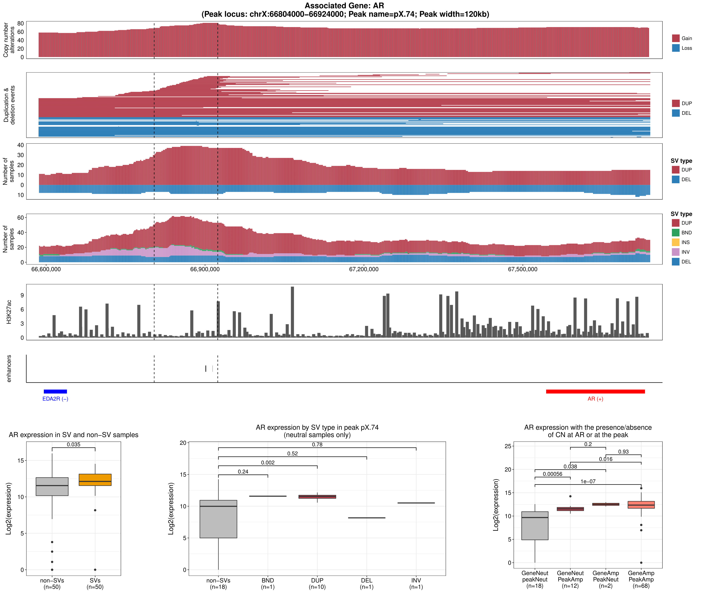

# SV-HotSpot

SV-HotSpot is structural vairant hotspots detection tool. It detects SVs and determine their effect on nearby gene expression using whole-genome sequecing data.  

##
SV-HotSpot is developed at [Christopher Maher Lab](http://www.maherlab.com/) at [Washington University in St. Louis](http://www.wustl.edu) and [The McDonnell Genome Institute](https://www.genome.wustl.edu/). 

## Getting Started

These instructions will help you to install and use SV-HotSpot tool. Please read carefully all instructions before using the tool. Also make sure that all prerequisites and R packages are installed with the versions specified.  

### Prerequisites

To run SV-HotSpot, the following tools have to be installed:

* [Perl](https://www.perl.org/get.html)  
* [BEDTools](https://bedtools.readthedocs.io/en/latest/) version 2.25.0
* [R](https://www.r-project.org/) version 3.1.0 or higher 

Please make sure you have installed the following R packages:

 1. [peakPick](https://cran.r-project.org/web/packages/peakPick/vignettes/peakPick-vignette.html)
 2. [ggplot2](https://cran.r-project.org/web/packages/ggplot2/index.html)
 3. [reshape2](https://cran.r-project.org/web/packages/reshape2/)
 4. [grid](https://www.rdocumentation.org/packages/grid/versions/3.5.1)
 5. [gridBase](https://cran.r-project.org/web/packages/gridBase/index.html)
 6. [gridExtra](https://cran.r-project.org/web/packages/gridExtra/index.html)
 7. [gtable](https://cran.r-project.org/web/packages/gtable/index.html)
 8. [ggsignif](https://cran.r-project.org/web/packages/ggsignif/vignettes/intro.html)
 9. [plyr](https://cran.r-project.org/web/packages/plyr/index.html)

### Installation

Download SV-HotSpot from github repository at https://github.com/ChrisMaherLab/SV-Hotspot. Click on "Clone or download" and then click on "Download ZIP".  Once the tool package is downloaded, run these commands:

```
$ unzip SV-Hotspot-master.zip
$ cd SV-Hotspot-master/SV-HotSpot
$ chmod +x install.sh
$ ./install.sh -o /SOME/PATH/
```

Note that you need to change ```/SOME/PATH/``` to wherever you want to install the tool. 
 
You also need to add the installation location to your PATH or add it to ~/.bachrc file before running the tool: 

```
export PATH=/SOME/PATH/src:$PATH
```
<b>CHANGING TOOL PATH (IMPORTANT) </b>

Open ```sv-hotspot.pl``` file and change this line by providing the path to the location where you installed the tool: 

```
my $TOOL_PATH='/gscmnt/gc5111/research/eteleeb/projects/SV-HotSpot';
```
Note that you also need to change the path of Rscript. For linux, this is usually ```/usr/bin/Rscript``` and for MAC OS X is ```/usr/local/bin/Rscript```. If your Rscript path is different from ```/usr/bin/Rscript```, you need to open all R files available at "src" folder and change this line ```/usr/bin/Rscript``` to your Rscript path. 

To test the tool, just type the following command which shows the usage of the tool assuming the tool src directory in the PATH otherwise you need to provide the whole path to the main file:

```
sv-hotspot.pl --help
```

### Input 
The tool requires as an inpute the following:

1. Genome name as an abbreviation (e.g. hg38, hg19, mm9, mm10, etc.)

2. Structural variants file in [BEDPE format](https://bedtools.readthedocs.io/en/latest/content/general-usage.html#bedpe-format) (Example of how to prepare this file is available in <b>test_data</b> folder).

3. Expression data in a matrix format where the first column represents the feature (e.g. gene) and columns represents samples. See the example provided at <b>test_data</b> folder. 

4. Copy number segments in [BED](https://genome.ucsc.edu/FAQ/FAQformat.html) format. See the example at <b>test_data</b> on how to prepare this file.  

Optional files: 

1. An annotation file in [BED](https://genome.ucsc.edu/FAQ/FAQformat.html) format. If the user didn't provide this file, a built-in annotation file based on the genome name will be used. 

1. Region of interest file(s) (e.g. enhancers, transcription binding sites, etc) in [BED](https://genome.ucsc.edu/FAQ/FAQformat.html) format. An example of this file is given in <b>test_data</b> folrder. 

2. ChIP-Seq coverage in [BED](https://genome.ucsc.edu/FAQ/FAQformat.html) format. See the example at <b>test_data</b> on how to prepare this file.  

All other parameters are optional and a default value was assigned to each (run ```sv-hotspot.pl --help``` for more details). 

<br>

<b>IMPORTANT NOTES:</b>

* To prepare all your files, please look carefully at the examples provided in <b>test_data</b> and do accordingly. 
* Structural variant types must be in the format of THREE letters. Possible SV types the tool accepts are: ```BND, DEL, DUP, INS, INV```. 
* All files headers should be the same as the ones in the examples files. 
* The chromosome names in all files should be consistent and in the format of <b>chr#</b>. 
* The feature name in the annotation file should be the same as the one in the expression file. 
* The "<b>name</b>" column in the SVs file should be in the format of <u><i>sample/type</i></u> (e.g. <b>SS1/INV</b>)

### Output 
There two main files output in BED format: 

1. ```annotated_peaks_summary_final.tsv```: this file has all information about identified peaks. 

2. ```genes.effected.by.SVs.tsv```: this file contains statisitcal information for all genes affected by SVs.

3. In addition, SV-HotSpot provides various visualizations composed of overlaying tracks representing copy number aggregation, SV aggregation, and gene/regulatory/region of interest annotation tracks. 

### Running the tests

To test the tool, we have provided an example data specifically for identifying SV hotspots affecting androgen receptor (AR) gene. To read more about this study, please refer to this [Cell paper](https://www.cell.com/cell/abstract/S0092-8674(18)30842-0).

To test the tool, just run the following command:

```
sv-hotspot.pl -g hg38 --sv test_data/sv.bedpe -r test_data/enhancers.bed -e test_data/exp.tsv 
              -c test_data/cna.tsv --chip-cov test_data/H3K27ac.bg -o /SOME/PATH --t-amp 2.99 
              --t-del 1.35 -p 0.05 --chip-cov-lbl H3K27ac --roi-lbl enhancers 
              -d 10000 --left-ext 0 --rigth-ext 0 
```

Note that you need to change ```/SOME/PATH``` with the output drectory you want. Once the tools is done, a folder called "sv-hotspot-output" wil have the final results. 

### Plot Peaks (Hotspot sites)
In some cases when the number of detected peaks is high, it is impractical to plot all peaks as this process takes long time. Thus, we set the tool to print only the top # of peaks (default is 10). In case you need to increase/decrease this number, you need to provide this parameter ```--plot-top-peaks=#``` with the required number. If you do not want to print any peak at this stage, change ```--plot-top-peaks = 0 ```. 

To plot peak(s), we provided a script for this process. You just need to provide the peak name(s), SV file, the results directory, the expression, and copy number data with the remaining parameters shown above. Peak names must be separated by comma. The following command plots peaks "pX.59" and "pX.60" as an exmaple. 

```
plot-peak.pl -p pX.59,pX.60 --sv test_data/sv.bedpe --res-dir /RESULTS/PATH -r test_data/enhancers.bed 
             -e test_data/exp.tsv -c test_data/cna.tsv --chip-cov test_data/H3K27ac.bg -o /SOME/PATH 
             --t-amp 2.99 --t-del 1.35 --chip-cov-lbl H3K27ac --roi-lbl enhancers --left-ext 0 --rigth-ext 0
```

### Example of tool visualization 


### ChIP-seq Coverage 
Usually ChIP-seq coverage data is ..... 

## References
1. Quigley, D. A., Dang, H. X., Zhao, S. G., Lloyd, P., Aggarwal, R., Alumkal, J. J., ... & Playdle, D. (2018). Genomic hallmarks and structural variation in metastatic prostate cancer. Cell, 174(3), 758-769.


## How to cite SV-HotSpot?

Coming soon .... 

## Contact
Abdallah Eteleeb: eteleeb@gmail.com
