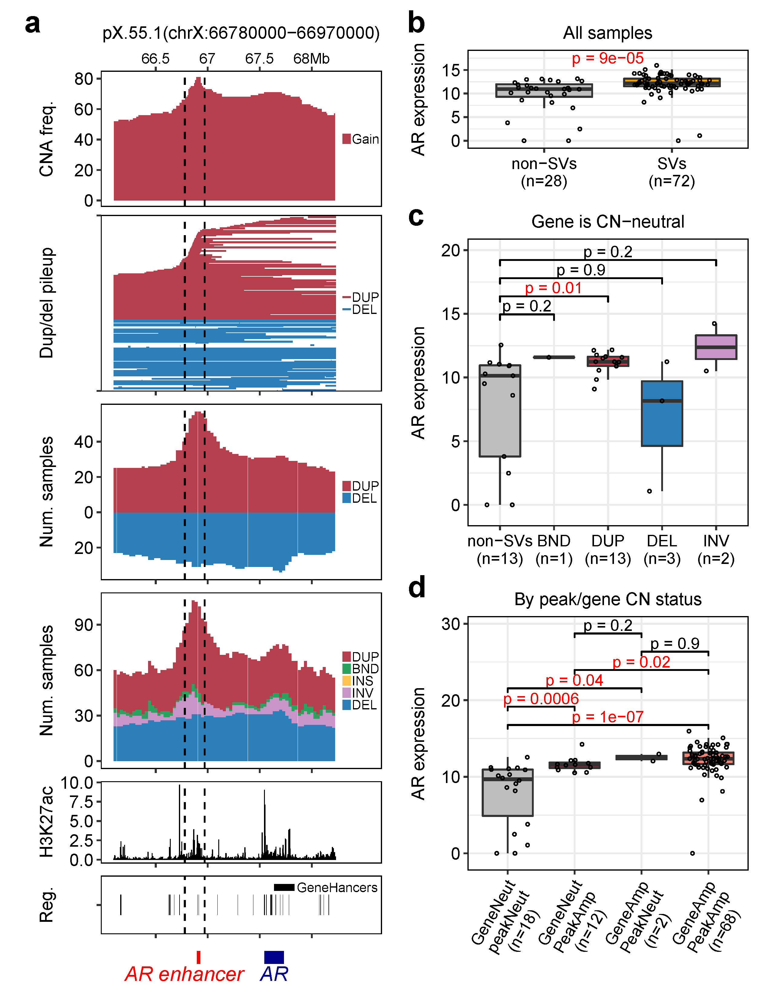

# SV-HotSpot: detection of hotspots targeted by recurrent structural variants associated with gene expression

<!--- SV-HotSpot is a structural variant hotspots detection tool. It detects SVs and determine their effect on nearby gene expression using whole-genome sequencing data.  -->
SV-HotSpot is a tool for detection and visualization of genome hotspots targeted by recurrent structural variants (SVs) associated with gene expression. To so so, SV-HotSpot seamlessly integrates SV calls, gene expression, genome annotations (inluding genes and other functional elements such as regulatory elements) to identify and annotate recurrent SVs, and assess their potential consequences on the expression of nearby genes.

##
SV-HotSpot is developed at [Christopher Maher Lab](http://www.maherlab.com/) at [Washington University in St. Louis](http://www.wustl.edu).

## SV-HotSpot Docker Instructions
To use SV-HotSpot, a docker image has been created and tested on Linux and Mac. To run SV-HotSpot, you need to have [Docker](https://docs.docker.com/) installed on your machine. 

### Docker Installation
* Ubuntu: follow [the instructions](https://docs.docker.com/engine/installation/linux/docker-ce/ubuntu/) to get Docker CE for Ubuntu.
* Mac: follow [the instructions](https://store.docker.com/editions/community/docker-ce-desktop-mac) to install [the Stable verion of Docker CE](https://download.docker.com/mac/stable/Docker.dmg) on Mac.
<!--- 
* Windows: follow [the instructions](https://docs.docker.com/toolbox/toolbox_install_windows/) to install [Docker Toolbox](https://download.docker.com/win/stable/DockerToolbox.exe) on Windows. 
-->

To obtain the latest docker image, run the following in your command line:

```
docker pull chrismaherlab/sv-hotspot
```
To test the image, run the following command which shows the usage of this tool:
```
docker run chrismaherlab/sv-hotspot sv-hotspot
```

```
USAGE:
      sv-hotspot.pl [OPTIONS] -g/--genome <genomeName> --sv <structuralVariants>

      NOTE:
	(1) Genome name should be one of the UCSC genome releases (https://genome.ucsc.edu/FAQ/FAQreleases.html#release1). 
            - Built-in Genomes: hg18, hg19, hg38, mm9, mm10, dm3, dm6, rn5, rn6.
            - Please refer to the documentation in case your genome is not listed above. 
	(2) Structutal variants file should be in "BEDPE" format.
	(3) Gene expression data and copy number segments are required to visualize hotspot regions.
	(4) Region of interest file(s) (e.g. promoters, enhancers, chip-seq, etc.) should be in "BED" format

OPTIONS:
	-w/--sliding-win-size		sliding window size	<int>		[ sliding window size. default: 100kb ]
	-s/--sliding-win-step		sliding window step 	<int>		[ sliding window step. default: 1kb ]
	-a/--annot			annotation file 	<filename>	[ an annotation file in "BED" format ]
	-e/--exp			expression file 	<filename>	[ expression file in a "matrix" format ]
	-c/--cn				Copy number file 	<filename>	[ copy number segments in BED format ]
	-W/--peakPick-window-size	peak calling window 	<int>		[ peakPick window size. default: 100bp ]
	-m/--peakPick-min-sd		peak calling min. SD	<int>		[ peakPick standard deviation cutoff. default: 5 ]
	-t/--pct-samples		percentage of samples	<int>		[ percentage of samples cutoff to call peaks. default: 10 ]
	-o/--output			output directory	<string>	[ results output directory. default: ./ ]
	-p/--pval			pvalue cuttoff		<float>		[ pvalue threshold used for significance. default: 0.05 ]
	-G/--genes-of-int		list of genes		<filename>	[ list of genes of interest to be used for visualization ]
	-r/--region-of-int		region(s) of interest	<filename>	[ region of interest file(s) in "BED" format separated by comma ]
	-C/--chrom			chromosome name 	<string>	[ chromosome name used to detect hotspots. default: ALL ]
	-t/--sv-type			structural variant type	<string>	[ SV type used to detect hotspots. default: ALL ]
	-d/--merge-dist-size		distance size		<int>		[ distance cutoff used to merge adjacent peaks. default: 10kb ]
	--merge-pct-samples		percentage of samples	<int>		[ percentage of samples cutoff to merge similar peaks. default: 5 ]
	--stop-merge-num-peaks		number of peaks		<int>		[ number of peaks cutoff to stop merging adjacent peaks. default: 0 ]
	-k/--num-nearby-genes		Number nearby genes	<int>		[ number of up/downstream genes to the peak. default: 1 ]
	--t-amp				amplification threshold	<float/int>	[ amplification cutoff. default: 2.8 ]
	--t-del				deletion threshold	<float/int>	[ deletion cutoff. default: 0.5 ]
	--stat-test			statistical test	<string>	[ statistical test used for comparison (wilcox.test or t.test). default: wilcox.test ]
	--chip-cov			chip-seq coverage	<filename>	[ chip-seq coverage file in "BED" foramt ]
	--chip-cov-lbl			chip-seq coverage label	<string>	[ label used for chip-seq coverage ]
	--plot-top-peaks		plot top # peaks	<int>		[ number of top peaks to plot. default: top 10 ]
	--left-ext			size of left extension	<int>		[ size of the left extension of the peak. default: 0bp ]
	--right-ext			size of right extension	<int>		[ size of the right extension of the peak. default: 0bp ]
	--genes-to-plot			genes names		<string>	[ names of genes to show on the plot. default: none.
										  If no genes were provided, all genes in the peak will be plotted ]
	--plot-layout			plot orientation	<string>	[ orientation of the peak plot (wide or narrow). default: narrow ]
 ```
 
### How to run SV-HotSpot using Docker?
We have provided an example data available in "test_data" folder specifically for identifying SV hotspots affecting androgen receptor (AR) gene. To read more about this study, please refer to this [Cell paper](https://www.cell.com/cell/abstract/S0092-8674(18)30842-0).

To run SV-HotSpot on this test data, use the following command:
```
docker run -v /local/folder:/data chrismaherlab/sv-hotspot sv-hotspot -g hg38 -C chrX \
              --sv /data/test_data/sv.bedpe -e /data/test_data/exp.tsv \
              -c /data/test_data/cna.tsv --chip-cov /data/test_data/H3K27ac.bg \
              -r /data/test_data/enhancers.bed -o /data/SV-HOTSPOT-TEST \
              -w 100000 -s 30000 -d 50000 --merge-pct-samples 5 \
              -t-amp 2.99 --t-del 1.35 --stat-test wilcox.test --pval 0.05 \
              --chip-cov-lbl H3K27ac --left-ext 100000 --right-ext 100000 \
              --plot-top-peaks 1 --genes-to-plot AR
```

* Note, the -v flags map your local filesystem locations to a “location” within the Docker image. Therefore, you need to change ```/local/folder```to your local folder on your machine. This folder must contain the "<b>test_data</b>" folder. The final output will be sent to this folder as well. Use ```"$PWD"``` in case you want to use the current directroy. 
* Please note that you need to provide the absolute path for ```/local/folder```. 
* ```/data``` is a folder on the image container used to receive the input data that was mapped by -v flag. The SV-HotSpot pipeline is configured with this folder and it has to be provided the same way as in the command above. 
<!---
* For users running Docker on Windows using Docker Toolbox, please note that you need to share your local driver with VirtualBox VM to be able to mount any folder from it into a Docker container. Instructions on how to perform that can be found in [Docker Toolbox](https://docs.docker.com/toolbox/toolbox_install_windows/) installation instructions page. An additional instructions can be found [here](https://headsigned.com/posts/mounting-docker-volumes-with-docker-toolbox-for-windows/) as well.   
-->

### Post-processing and filtering
Once hotspots of SVs are identified, users should perform post-processing and filtering. SV-HotSpot provides a script to perform post-filtering of the results based on multiple criteria including filtering of genes with low expression and/or weak expression association (p-value, logFC, mean group expression), removal of wide peaks not associated with known cancer genes (eg. using COSMIC census genes), removal of peaks with low number of samples harboring hotspot SVs.  To performed filtering, run the ```filter.r``` command as follows:

 ```
 Usage:  Rscript filter.r
             <SV-HotSpot_result_dir>
             <max.p-value-to-infer-expression-association>
             <min.logfc>
             <min.group.expr>
             <max.number.of.associated.gene.per.peak, peak w/ more genes associated are ignored>
             <max.peak.length, peak wider than this w/o assoc. w/ known genes are ignored>
             <min.peak.percent.samples, 0-100, peaks with percent of samples smaller than this are ignored>
             <tsv_file_of_cosmic_census_genes>
             <csv_other_known_genes_to_keep>

         Example: 
            Rscript filter.r /path/to/sv-hotspot-output 0.05 0.22 10 9 500000 15 \
                             data/cosmic_census_genes.tsv AR,ERG,PTEN,TP53
```

Output will be written to SV-HotSpot result directory which includes the following two files: 

    1) annotated_peaks_summary.filtered.tsv
    2) genes.associated.with.SVs.filtered.tsv


### Visualization of hotpots (peaks)
The top hotspots are automatically visualized when running SV-Hotspot detection (parameter ```--plot-top-peaks=#``` when running SV-HotSpot detection). Additionally, users can plot hotspots identified by SV-HotSpot independently of SV-Hotspot detection. To plot hotspot sites (or peaks), run the following command:

To show the usage page of this script, run the following command: 
```
docker run chrismaherlab/sv-hotspot plot-peak
```
To plot peaks, use the following command which plots pX.172 and pX.173 peaks (peak name(s) taken from "annotated_peaks_summary.tsv" output file). You will also need to provide the SV calls file used to run SV-Hotspot, path to SV-HotSpot results directory, expression and copy number data, and the remaining parameters shown in SV-HotSpot detection command above. Peak names must be separated by comma and no space between them.

```
docker run -v "$PWD":/data chrismaherlab/sv-hotspot plot-peak \
           -p pX.55.1 --genes-to-plot AR \
           --res-dir /data/SV-HOTSPOT-TEST/sv-hotspot-output \
           -o /data/SV-HOTSPOT-TEST/sv-hotspot-output \
           --sv /data/test_data/sv.bedpe -e /data/test_data/exp.tsv \
           -c /data/test_data/cna.tsv --chip-cov /data/test_data/H3K27ac.bg \
           -r /data/test_data/enhancers.bed --t-amp 2.99 --t-del 1.35 \
           --chip-cov-lbl H3K27ac --left-ext 100000 --right-ext 100000
```
* ```res-dir``` must refer to the folder containing the results generated from running sv-hospot command with ```-o``` option. Please note that you need to include "sv-hotspot-output" at the end of ```res-dir``` path since SV-HotSpot always creates this folder which is used to write all output results.

### Visualization of whole genome and individual chromsomes
SV-HotSpot also provides whole genome level visualization of hotspot sites. The script ```plot_whole_genome.r``` can be used to generate the histogram aggregation of the counts of samples harboring structural variants at whole genome level (circos plot) or individual chromosome level. This script can be run as follows.

```
   Usage: Rscript plot_whole_genome.r
             <SV-Hotspot_result_dir>
             <annotation_dir>
             <genome_assembly_version, eg. hg38>
             <plot_circos, eg. TRUE, FALSE>
             <chromosomes_to_plot, eg. "ALL", "chr1,chrX"> 
             <genes_to_show, eg. "ERG,PTEN,ETV1">
             <color_genes_by_association_direction_with_SV, eg. "TRUE", "FALSE">
             <output_figure_format, eg. "png", "pdf">
             <output_figure_dir>

   Example:
           Rscript plot_whole_genome.r /path/to/sv-hotspot-output /path/to/annotations \
                                        hg38 TRUE chr1,chrX,chr21 ERG,AR,PTEN TRUE png out
```
<!---
## SV-HotSpot Conda Installation
This package is available as conda package.  To install it via `conda`, try the following:

```bash
# create and activate a conda environment
conda create --yes --prefix /path/to/conda/environment
conda activate /path/to/conda/environment

# install sv-hotspot via conda
conda install --yes \
    --channel bioconda \
    --channel conda-forge \
    --channel https://raw.githubusercontent.com/eteleeb/SV-HotSpot/conda-channel/channel/  \
    --channel default \
    sv-hotspot

# test out installation
which sv-hotspot.pl  # should be /path/to/conda/environment/bin/sv-hotspot.pl
sv-hotspot.pl --help

# To run the test, use the following command:

sv-hotspot.pl -g hg38 -C chrX -o SV-HOTSPOT-BIOCONDA-TEST \
              --sv /path/to/test_data/sv.bedpe -e /path/to/test_data/exp.tsv \
              -c /path/to/test_data/cna.tsv -r /path/to/test_data/enhancers.bed \
              --chip-cov /path/to/test_data/H3K27ac.bg \
              -w 100000 -s 1000 --t-amp 2.99 --t-del 1.35 \
              --stat-test wilcox.test --pval 0.05 \
              --chip-cov-lbl H3K27ac -d 10000 --left-ext 0 \
              --right-ext 0 --plot-top-peaks 2

# get out of conda environment
conda deactivate

# remove the conda environment
rm -rf /path/to/conda/environment

```
-->

## SV-HotSpot Manual
### Input 
The tool requires as an input the following:

1. Genome assembly name (e.g. hg38, hg19, mm9, mm10, etc.) which is used to extract chromosomes sizes file (a tab-delimited file with two columns, <b>chrom</b> and <b>size</b>). Genome name should be one of the UCSC genome releases (https://genome.ucsc.edu/FAQ/FAQreleases.html#release1). SV-HotSpot built-in genomes are: <b>hg18, hg19, hg38, mm9, mm10, dm3, dm6, rn5, rn6</b>. 
<!---
In case your genome is not listed above, please do the following:

      * Create a directoy with your genome name under ```annotations``` folder. This name will be used when run the tool.    
      * Extract the chromosomes sizes file if your genome is available as one of the UCSC genome releases by running this             command:    
       
        ```mysql --user=genome --host=genome-mysql.cse.ucsc.edu -A -e "SELECT chrom, size FROM <genomeName>.chromInfo" > chromsize.tsv```
      
      * Save the file with the name ```chromsize.tsv``` and place in the genome name folder you created in step 1.
      * In case your genome is not available in the UCSC genome releases, you need to prepare a a tab-delimited file with two columns, <b>chrom</b> and <b>size</b> and do step 3. 
-->

2. Structural variants file in [BEDPE format](https://bedtools.readthedocs.io/en/latest/content/general-usage.html#bedpe-format) (Example of how to prepare this file is available in <b>test_data</b> folder). In case only VCF files are available, please try to convert them to BEDPE format using existing tools such vcftobedpe form svtools. Instructions on how to install it and use it can be found [here](https://github.com/hall-lab/svtools/blob/master/README.md). 

<u>Optional files:</u> 
1. Expression data in a matrix format where the first column represents the feature (e.g. gene) and columns represents samples. See the example provided at <b>test_data</b> folder. Please note that features in this file have to be unique. 

2. Copy number segments in [BED](https://genome.ucsc.edu/FAQ/FAQformat.html) format. See the example at <b>test_data</b> on how to prepare this file.  

3. An annotation file in [BED](https://genome.ucsc.edu/FAQ/FAQformat.html) format. If the user didn't provide this file, a built-in annotation file based on the genome name will be used. Please note that the feature in the expression file has to match the one in this file. 

4. Region of interest file(s) (e.g. enhancers, transcription binding sites, etc) in [BED](https://genome.ucsc.edu/FAQ/FAQformat.html) format. An example of this file is given in <b>test_data</b> folder. Multiple files can be provided but have to be separated by comma (make sure no space between the file names). 

5. ChIP-Seq coverage in [BED](https://genome.ucsc.edu/FAQ/FAQformat.html) format. See the example at <b>test_data</b> on how to prepare this file.  

All other parameters are optional and a default value was assigned to each (run ```sv-hotspot.pl --help``` for more details). 

<br>

<b>IMPORTANT NOTES:</b>

* To prepare all your files, please look at the examples provided in <b>test_data</b> folder and do accordingly. 
* Structural variant types must be in the format of THREE letters and should only include the following types: ```BND, DEL, DUP, INS, INV```. 
* All files headers should be the same as the ones in the examples files. 
* The chromosome names in all files should be consistent and in the format of <b>chr#</b>. 
* The feature name in the annotation file and the expression file should be the same. 
* The "<b>name</b>" column in the SVs file should be in the format of <u><i>sample/type</i></u> (e.g. <b>Sample1/INV</b>)

### ChIP-seq coverage data 
Given the large quantities of data generated in ChIP-Seq, most computational analyses face significant challenges processing this large magnitude of data. Therefore, it is recommended that you average ChIP-seq data using a window of size range from 1-10k and provided in the format mentioned above.

### Output 
There are two main output files: 

1. ```annotated_peaks_summary.tsv```: this file has all information about identified peaks. 

2. ```genes.associated.with.SVs.tsv```: this file contains statisitcal information for all genes affected by SVs.

3. In addition, SV-HotSpot provides various visualizations composed of overlaying tracks representing copy number aggregation, SV aggregation, and gene/regulatory/region of interest annotation tracks. 

<u>Additional files:</u> 

1. Peaks files for each chromosome and their corresponding figures. These files are located in the ``peaks`` folder. 
2. UCSC custom track files. These files are located in ``peaks/ucsc_custom_track_files``. These files can be viewed on the UCSC Genome Browser.  

<!---
### Running the tests

To test the tool, we have provided an example data specifically for identifying SV hotspots affecting androgen receptor (AR) gene. To read more about this study, please refer to this [Cell paper](https://www.cell.com/cell/abstract/S0092-8674(18)30842-0).

To test the tool, just run the following command:

```
sv-hotspot.pl -g hg38 -C chrX --sv test_data/sv.bedpe -e test_data/exp.tsv -c test_data/cna.tsv \
              --chip-cov test_data/H3K27ac.bg -r test_data/enhancers.bed -o /SOME/PATH \
              -w 100000 -s 1000 --t-amp 2.99 --t-del 1.35 --stat-test wilcox.test --pval 0.05 \
	      --chip-cov-lbl H3K27ac -d 10000 --left-ext 0 --right-ext 0 
```

Note that you need to change ```/SOME/PATH``` with the output directory you want. Once the tools is done, a folder called "sv-hotspot-output" wil have the final results. 

### Plot Peaks (Hotspot sites)
In some cases when the number of detected peaks is high, it is impractical to plot all peaks as this process takes long time. Thus, we set the tool to plot only the top # of peaks (default is 10). In case you need to increase/decrease this number, you need to provide this parameter ```--plot-top-peaks=#``` with the number of peaks required. Set this parameter to 0 in case you do not want to plot any peaks. 

To plot peak(s), we provided a script for this process. You just need to provide the peak name(s), SV file, the results directory, the expression, and copy number data with the remaining parameters shown above. Peak names must be separated by comma. To show the usage page of this command type the following command: 
```
plot-peak.pl

USAGE:
      plot-peak.pl [OPTIONS] -p <peakName1,peakName2,...> --sv <structuralVariants> --res-dir <resultsDirectory> -e/--expr <expression> -c/--cn <copynumber>

      NOTE:
	(1) Results directory should be the same as the output directory used with sv-hotspot.pl

OPTIONS:
	-a/--annot	Annotation file 	<filename>	[ an annotation file in BED format ]
	-o/--output	output directory	<string>	[ default: ./ ]
	--t-amp		amplification threshold	<float/int>	[ threshold for copy number amplifications. default: 2.8 ]
	--t-del		deletion threshold	<float/int>	[ threshold for copy number deletions. default: 0.5 ]
	--chip-cov	chip-seq coverage	<filename>	[ If ChIP-Seq coverage file is provided, peaks will be overlapped with this file ]
	--chip-cov-lbl	chip-seq coverage label	<string>	[ the chip-seq coverage label used in the plot (e.g. histone name) ]
	--left-ext	size of left extension	<int>		[ number of extended bases from the left side of the peak. default: 0 ]
	--right-ext	size of right extension	<int>		[ number of extended bases from the right side of the peak. default: 0 ]
```

As an example, the following command plots peaks "pX.59" and "pX.60" generated from the above test. 

```
plot-peak.pl -p pX.59,pX.60 --sv test_data/sv.bedpe --res-dir /RESULTS/PATH -e test_data/exp.tsv \
             -c test_data/cna.tsv --chip-cov test_data/H3K27ac.bg -r test_data/enhancers.bed \
             -o /SOME/PATH --t-amp 2.99 --t-del 1.35 --chip-cov-lbl H3K27ac --left-ext 0 --rigth-ext 0
```
-->

### Example of SV-HotSpot visualization 
#### (1) Recurrent SVs targeting a non-coding region located upstream of AR gene:
<div align="center">

</div>

#### (2) Circos plot of recurrent SV hotspots identified by SV-HotSpot across the genome:
<div align="center">

</div>

##
## References
1. Quigley, D. A., Dang, H. X., Zhao, S. G., Lloyd, P., Aggarwal, R., Alumkal, J. J., ... & Playdle, D. (2018). Genomic hallmarks and structural variation in metastatic prostate cancer. Cell, 174(3), 758-769.


## How to cite SV-HotSpot?

Coming soon .... 

## Contact
Abdallah Eteleeb: eteleeb@wustl.edu
